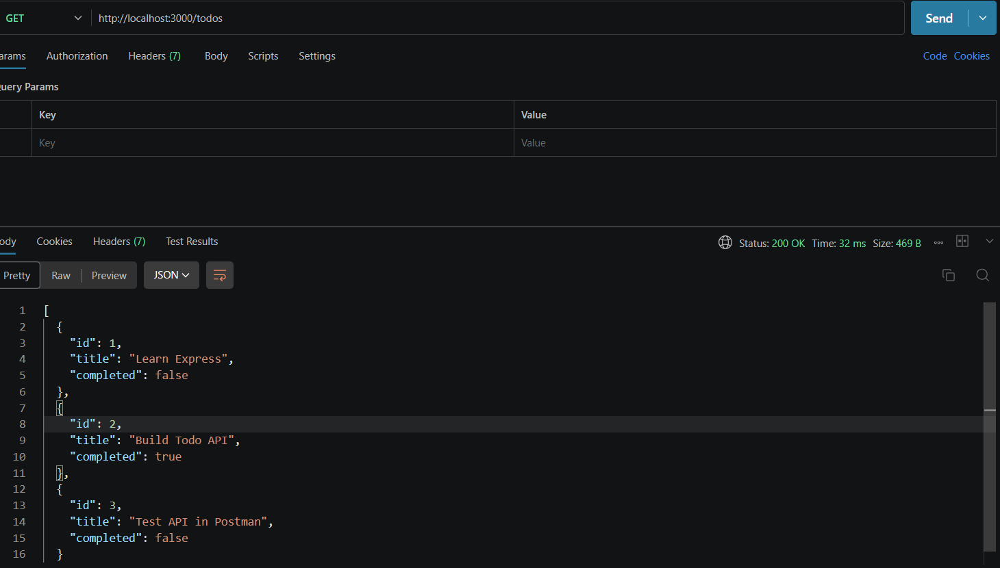
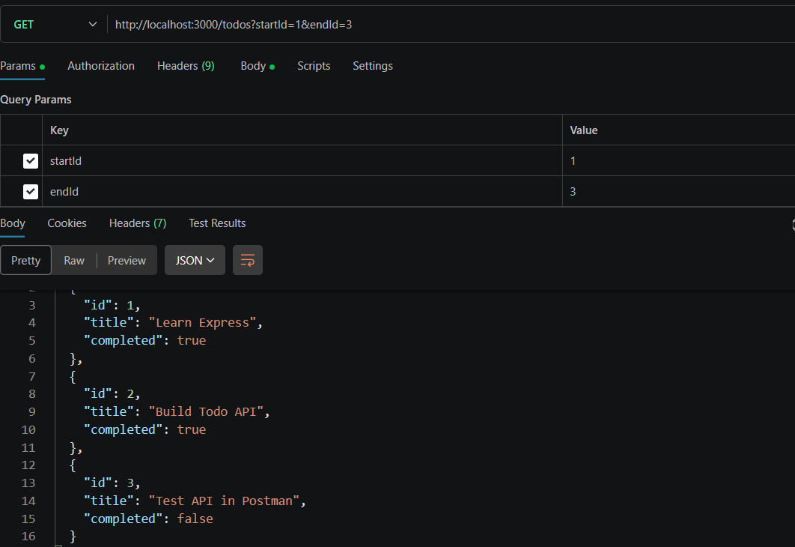
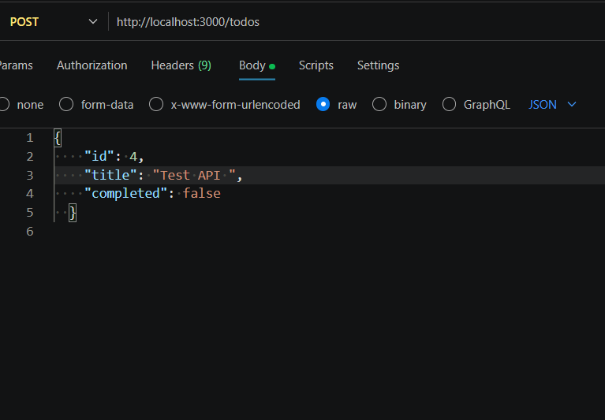
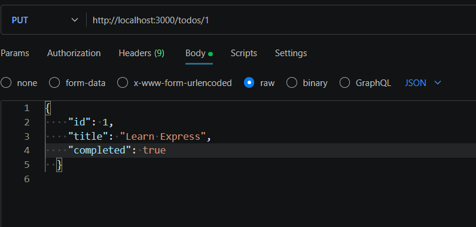
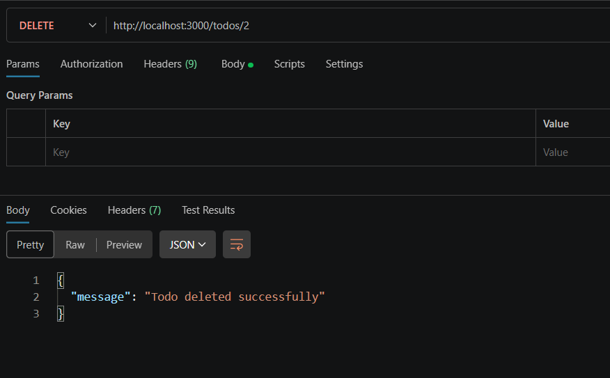

# Todo API

## Overview

A RESTful API built with Node.js and Express.js for managing todos with complete CRUD functionality.

## Installation

```
npm install express
node server.js
```

---

## API Endpoints

### 1. Get All Todos

Retrieves all todos from the database without any filtering.



---

### 2. Get Todos by Range

Retrieves todos within a specified ID range (e.g., /todos/1-3).



---

### 3. Create Todo

Creates a new todo with title, description, and completion status.



---

### 4. Update Todo

Updates an existing todo with new information by ID.



---

### 5. Delete Todo

Deletes a single todo or range of todos by ID.



---

## Status Codes

- 200 OK
- 201 Created
- 400 Bad Request
- 404 Not Found
- 500 Internal Server Error

## Project Structure

```
todo-api/
├── server.js
├── todos.json
├── package.json
├── README.md
└── screenshots/
```

## Author

[Your Name]

## Date

May 13, 2026
